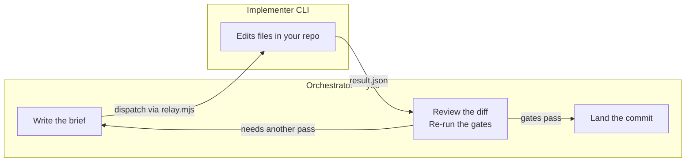

# delegate-skills

[](https://github.com/amElnagdy/delegate-skills/actions/workflows/relays.yml)
[](https://www.skills.sh/amElnagdy/delegate-skills)
[](LICENSE)

**Delegate the implementation. Keep the review, and the commit.**

Your agent writes a self-contained brief, hands it to a separate implementer CLI, waits for a
structured result, then reviews the diff and commits it itself. No relay in this repo ever commits.

```bash
npx skills add amElnagdy/delegate-skills
```

Then, in your orchestrating agent:

```text
Use $codex-delegate to have Codex implement the refactor in services/billing/, then review and commit it.
```

## The skills

Same loop, one implementer per skill. Pick the row you have a CLI for:

| Skill | Implementer CLI | Write access (default) | Read-only run | Resume |
| --- | --- | --- | --- | --- |
| [`agy-delegate`](skills/agy-delegate/SKILL.md) | Google Antigravity (`agy`) | Antigravity's own `permissions`; bypass opt-in | — [^none] | `--resume-last`, `--conversation <id>` |
| [`claude-delegate`](skills/claude-delegate/SKILL.md) | [Claude Code](https://code.claude.com/docs/en/overview) (`claude`) | `acceptEdits` + explicit tool surface | `--read-only` (`plan` mode) | `--resume-last`, `--session <id>` |
| [`codex-delegate`](skills/codex-delegate/SKILL.md) | [OpenAI Codex](https://github.com/openai/codex) (`codex`) | `--sandbox workspace-write` | `--read-only` | `--resume-last`, `--session <id>` |
| [`cursor-delegate`](skills/cursor-delegate/SKILL.md) | [Cursor Agent](https://cursor.com/cli) (`cursor-agent`) | `--force`; `--no-force` withholds command approval | `--read-only` (plan mode) | `--resume-last`, `--session <id>` |
| [`grok-delegate`](skills/grok-delegate/SKILL.md) | Grok Build (`grok`) | workspace-scoped; `--full-access` opt-in | `--read-only` — best-effort [^grok] | `--resume-last`, `--session <id>` |
| [`kimi-delegate`](skills/kimi-delegate/SKILL.md) | [Kimi Code](https://moonshotai.github.io/kimi-code/en/) (`kimi`) | `auto permission mode`, always | — [^none] | `--resume-last`, `--session <id>` |
| [`opencode-delegate`](skills/opencode-delegate/SKILL.md) | [OpenCode](https://opencode.ai) (`opencode`) | agent `build` (`--model` required) | `--read-only` (agent `plan`) | `--resume-last`, `--session <id>` |
| [`pi-delegate`](skills/pi-delegate/SKILL.md) | [Pi](https://github.com/earendil-works/pi-mono) (`pi`) | full local tools — no sandbox, no permission modes [^none]; project trust opt-in | `--read-only` (`read,grep,find,ls`) | `--resume-last`, `--session <id>` |
| [`qoder-delegate`](skills/qoder-delegate/SKILL.md) | [Qoder](https://docs.qoder.com/en/cli/quick-start) (`qodercli`) | `auto` permission mode; bypass opt-in | `--permission-mode plan` | `--resume-last`, `--resume <id>` |
| [`vibe-delegate`](skills/vibe-delegate/SKILL.md) | [Mistral Vibe](https://github.com/mistralai/mistral-vibe) (`vibe`) | `accept-edits`; `--full-access` opt-in | `--plan-only` (`plan` agent) | `--resume-last`, `--session <id>` |

[^none]: No CLI-enforced read-only mode. `touchedFiles` and the diff, not a flag, are the guarantee.

[^grok]: `grok` cannot be prevented from writing headlessly, so the relay snapshots the tree and sets
`readOnlyViolation: true` when a read-only run wrote anyway.

Each skill name links to its `SKILL.md`, which owns that implementer's prerequisites, flags, and
caveats. Building one for another CLI? [Claim it first](../../issues?q=is%3Aissue+label%3Aimplementer),
then see [CONTRIBUTING.md](CONTRIBUTING.md).

### Domain skills

One skill picks the row for you. It launches no CLI of its own — it classifies the brief, prepends
the domain's engineering standards, and dispatches through a sibling above, whose relay owns every
CLI-specific mechanic and writes the result.

| Skill | Domain | Routes to | Override |
| --- | --- | --- | --- |
| [`wordpress-delegate`](skills/wordpress-delegate/SKILL.md) | WordPress, WooCommerce, Elementor, ACF, WPForms | `codex`, `grok`, `kimi`, `opencode` — by lane | `--implementer`, `--lane`, `--strict-routing` |

Reach for it when the user wants WordPress work delegated but hasn't named the implementer; reach for
a row above when they have. `--dry-run` prints the routing decision without dispatching, and
`--list-routes` prints the lane table.

## Install

Browse first:

```bash
npx skills add amElnagdy/delegate-skills --list
```

Install the package, or just one skill (any name from the table above):

```bash
npx skills add amElnagdy/delegate-skills
npx skills add amElnagdy/delegate-skills --skill codex-delegate
```

Install for a specific agent, or globally:

```bash
npx skills add amElnagdy/delegate-skills --skill codex-delegate --agent claude-code
npx skills add amElnagdy/delegate-skills --global
```

Works with any orchestrating agent the [Skills CLI](https://github.com/vercel-labs/skills) supports.

## What it does



1. **Write a brief** — self-contained task context; the implementer has no orchestrator chat history.
2. **Dispatch** it with the bundled `relay.mjs`.
3. **Wait** for completion — the relay writes a structured `result.json`.
4. **Review** the diff — re-run the project's gates yourself; pair with [guard skills](https://github.com/amElnagdy/guard-skills).
5. **Land** it — *you* commit, because committing belongs to the reviewer.

```text
Use $claude-delegate to have a separate Claude Code session implement the parser fix, then review and commit it.
Use $codex-delegate to run this queue of migration tasks through Codex while I review each one.
```

Every relay speaks the same `delegate-relay.result.v1` contract: `status`, `exitCode`, `signal`
(with a host-killed hint when the OOM killer ends a run), the implementer's own final report,
`touchedFiles`, and a session id where the CLI exposes one. Learn the loop once, swap the implementer
freely.

You feel it when a bounded task — a migration, a mechanical refactor, a removal sweep — comes back as
a clean diff with a structured report, and you land it after re-running the gates yourself instead of
typing it all by hand.

## What counts as a delegate skill

Four invariants hold for every skill here. They are also the bar for a new one:

- **A separate CLI edits a real working tree, and the diff is the deliverable.** Not an API wrapper,
  not a gateway — an implementer whose work you can read with `git diff`.
- **The relay never commits.** Committing belongs to the reviewer, always.
- **Node built-ins only.** No dependencies, no network calls of its own, no credentials, no telemetry.
  The relay launches its implementer CLI and `git`, plus the platform process launcher where a Windows
  shim or a process-tree kill needs one.
- **Autonomy is stated in the CLI's own terms**, and whatever it cannot enforce is said plainly — see
  the two footnotes above.

This is a loop, not a forwarder: a forwarder hands over one task and returns the output. Here you
dispatch, poll, review, and land, across one task or a queue. It stays complementary to a vendor's own
plugin or subagents — those coordinate inside one agent; this keeps the contract portable across
orchestrators, with the commit on the reviewer.

Full checklist: [CONTRIBUTING.md](CONTRIBUTING.md).

## Requirements

- The implementer CLI for the skill you install, authenticated as you would at the terminal. Each
  skill's `SKILL.md` carries its own install and login commands.
- Node 18+ and `git`.
- An orchestrating agent that can run shell commands and read files.
- Shell examples assume bash/zsh (macOS/Linux, or Git Bash/WSL on Windows).

## Trust and validation

This package is intentionally inspectable:

- All skill content is Markdown, plus exactly **one** executable per skill — each a `scripts/relay.mjs`.
- Each `relay.mjs` makes no network calls, reads or writes no credentials, sends no telemetry, and has
  no dependencies (Node built-ins only). It launches its implementer CLI and `git`, plus the platform
  process launcher/termination utility where a Windows shim or process-tree kill requires one. The
  implementer CLI authenticates exactly as you do at the terminal. Read the script before you run it.
- None of the relays ever commit — committing is always the orchestrator's job, after review.

**Verification status** — claims here are backed by runs, not assumptions.

True of every relay: argument handling, exit codes, `result.json` shape, resume, and signal reporting
are verified, along with each implementer-specific guard.

Per skill — platform, CLI version, and what the run exercised:

- `agy-delegate` — macOS, `agy` 1.0.16: headless edit run, `--print=` delivery, absolute `--add-dir`
  workspace pin.
- `claude-delegate` — macOS, `claude` 2.1.220: write run under `acceptEdits`; plan mode refusing an
  edit, with the porcelain tripwire true on a violation and false on a clean run;
  `--session`/`--resume-last` resume; `claude_unavailable`/127 and usage errors exiting 2 without a
  result file; deny rules and the shell sandbox blocking `git commit`, `git push`, `git -C <dir> push`,
  a nested `claude`, and a `$HOME` write.
- `cursor-delegate` — Windows, `cursor-agent` 2026.07.23-e383d2b: write run under `--force`; plan-mode
  `--read-only` touching nothing; `--session <id>` resume applying a delta brief; usage errors exiting
  2. A maintainer-run native macOS plan-mode smoke against the same version captured model, session,
  and usage with no touched files.
- `grok-delegate` — macOS, `grok` 0.2.101: streaming-json report capture, file-based brief delivery,
  resume; read-only is best-effort by measurement, hence the violation flag.
- `kimi-delegate` — macOS, `kimi` 0.24.0: headless `-p` edit run, stream-json parsing, and both
  resume paths — the relay's `--session`/`--resume-last`, which drive Kimi's own `--session` and
  `--continue`.
- `pi-delegate` — macOS: stdin brief delivery, explicit provider and model selection, JSON
  session/provider/model/usage capture, and a `--read-only` run leaving a clean tree. Write,
  `--session`, and `--resume-last` runs are contributor-reported.
- `qoder-delegate` — macOS, `qodercli` 1.0.47, by the contributor: Lite edit run, `accept_edits`,
  explicit model and 32768-token context window, no commit.
- `codex-delegate`, `opencode-delegate`, `vibe-delegate` — contract-tested only: argument validation,
  bounded version preflight, missing binary, result parsing, and whole-process-tree timeout/abort
  cleanup. No end-to-end run is recorded here.
- `wordpress-delegate` — native Windows, through `codex-delegate` with `codex` 0.144.1: a write run
  on a throwaway plugin repo, routed by the table, with the preamble visible in the result
  (`check_ajax_referer` + `current_user_can`, `wp_unslash`/`absint`, `$wpdb->prepare()`, `esc_html`
  at output, text domain, and the `wp_ajax_nopriv` registration dropped), the thread id lifted for
  resume, and no commit made. Contract-tested besides: every shipped lane's routing decision, the
  read-only demotion rule, `--strict-routing`'s refusal, the read-only and resume flag translation
  for all ten implementers, a missing sibling relay, and the shared atomic-publish, `--timeout`
  validation, and whole-process-tree timeout cleanup. Only `codex` has been driven live; the other
  three lane targets are contract-tested. The aborted path is POSIX-only in the suite and has not
  been driven for this relay on any platform.

Not yet verified: native Windows launches for `agy`, `claude`, `grok`, `kimi`, `pi`, `qoder`, and
`vibe` (the `codex`/`opencode`/`grok` `.cmd` shim handling is in place and quoted; Cursor serializes a
pre-joined, quoted command; Qoder and Vibe target their documented native executables). Claude's own
shell sandbox is unsupported on native Windows regardless of launch mechanics, and upstream Vibe
officially targets UNIX. A native Linux `cursor-agent` run is unverified. The full delegate → review →
commit loop is designed for and run on Claude Code; other orchestrators (Cursor, …) are designed-for
but unproven.

## Repository shape

Every skill has the same shape — a lean `SKILL.md`, four references that load only when needed, and
one inspectable script:

```text
skills/
└── <name>-delegate/
    ├── SKILL.md
    ├── scripts/relay.mjs
    └── references/
        ├── writing-the-brief.md
        ├── dispatch-and-poll.md
        ├── review-and-land.md
        └── multi-task-queues.md
```

A domain skill has the same shape and the same four invariants; its `relay.mjs` dispatches through a
sibling's rather than launching a CLI directly, so the sibling's guarantees are the ones in force.

Adding an implementer is a new directory plus two lines here: a table row, and a verification line once
a run backs it.

Contributing? House rules, the controlled vocabulary, and the pre-publish checklist live in
[AGENTS.md](AGENTS.md) — read it before opening a pull request, and point your agent at it too.

## License

MIT — see [LICENSE](LICENSE).
